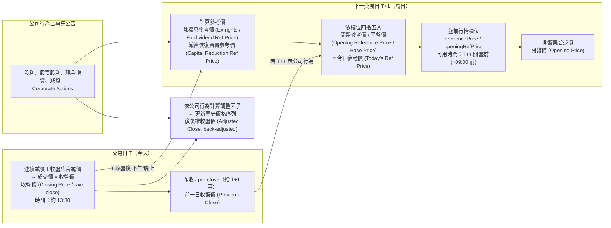

# FinLab

> Goal: get previous close price / reference price

- [Historical Stats | Fugle Developer Docs](https://developer.fugle.tw/docs/data/http-api/historical/stats)
  - Has `closePrice`

- 收盤價：Closing Price / raw close
- 昨收 / 前一日收盤價：Previous Close / Pre-close
- 除權息參考價：Ex-rights / Ex-dividend Reference Price
- 減資恢復買賣參考價：Capital Reduction Reference Price
- 開盤參考價 / 平盤價：Opening Reference Price / Base Price / Today’s reference price
- 開盤價：Opening Price
- 後復權收盤價：Adjusted Close (back-adjusted)

---

[Reference Price for Capital Reduction - Taiwan Stock Exchange Corporation](https://www.twse.com.tw/en/announcement/reduction/twtauu.html)

**Formulas:**

1. The following figures are referred from “Capital Reduction Announcement”  
    (A): Closing Price on The Last Trading Date  
    (B): Cash Amount of Refund Per share  
    (C): Ratio of Post- Reduction Outstanding Shares to Original Outstanding Shares  
    (D): Subscription Price per New Share  
    (E): Subscription Ratio of Post-Reduction to New Shares Issued  
    (F)：Cash dividend
2. Capital reduction by cash refund of capital stock  
    Post-Reduction Reference Price＝ [ (A)-(F)-(B) ] / (C)
3. Capital reduction for purposes of making up losses  
    Post-Reduction Reference Price＝ (A) / (C)
4. Capital Reduction and Cash Injection  
    Post-Reduction Reference Price＝ (A) / (C)  
    Ex-right Reference Price = [Post-Reduction Reference Price +(D)*(E) ] / [ 1+(E) ]
