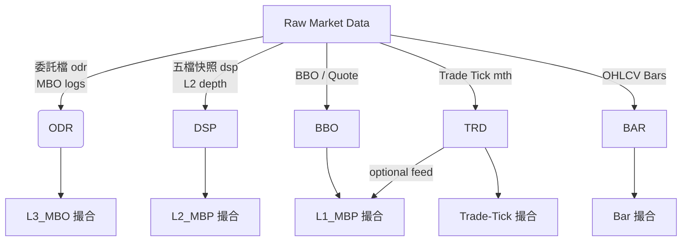
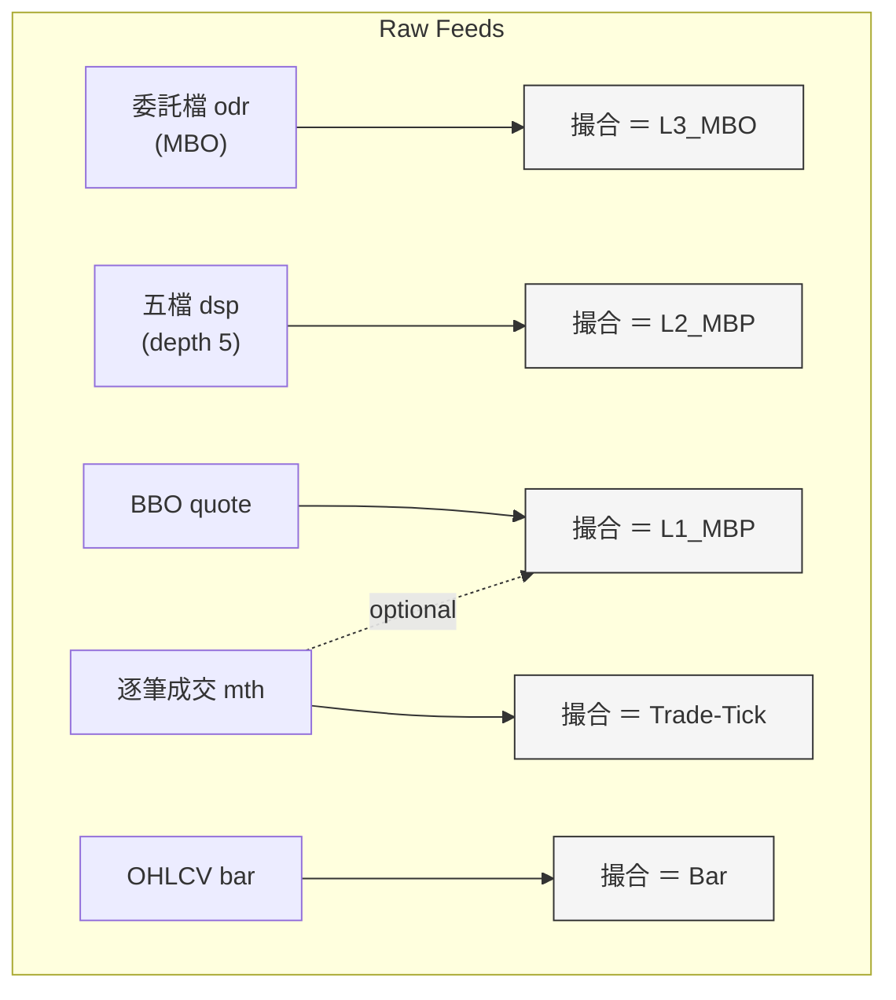
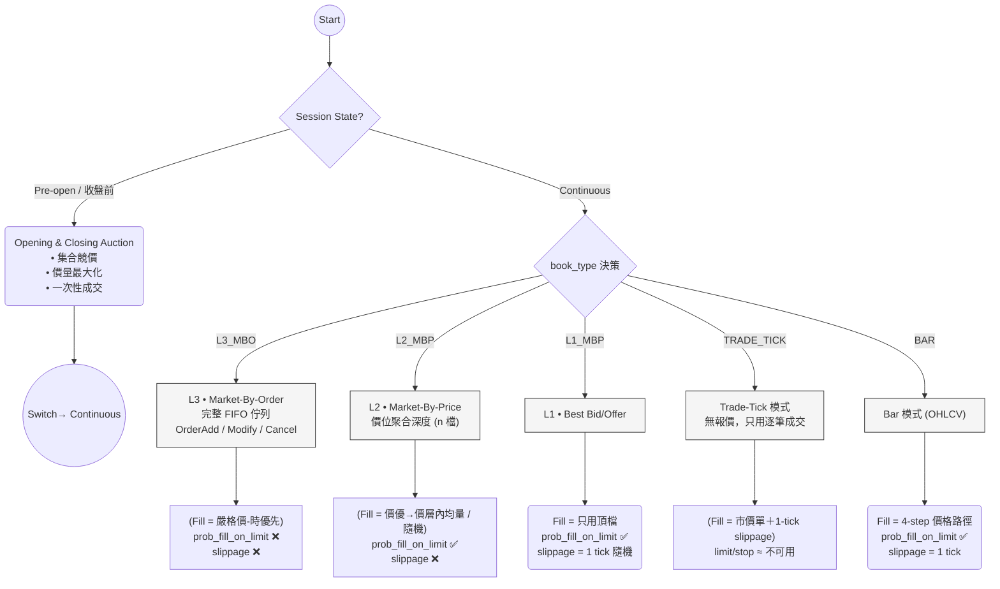
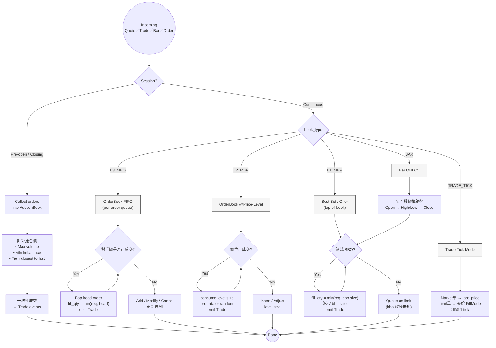
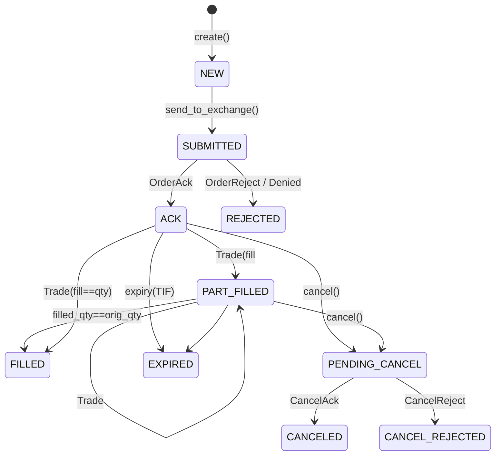
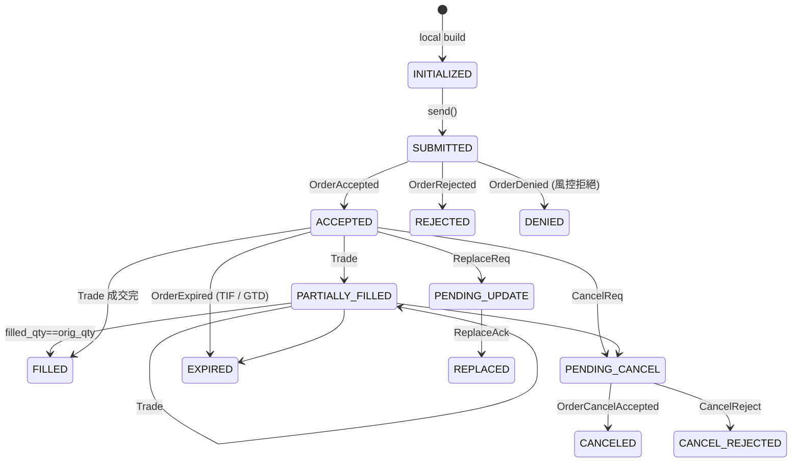

# Nautilus Trader

```mermaid
graph TD
    %% 原始資料
    RAW[Raw Market Data] -->|委託檔 odr<br>MBO logs| OD(ODR)
    RAW -->|五檔快照 dsp<br>L2 depth| DSP
    RAW -->|BBO / Quote| BBO
    RAW -->|Trade Tick mth| TRD
    RAW -->|OHLCV Bars| BAR

    %% 對應撮合模式
    OD  --> L3[L3_MBO 撮合]
    DSP --> L2[L2_MBP 撮合]
    BBO --> L1[L1_MBP 撮合]
    TRD --> TICK[Trade-Tick 撮合]
    BAR --> BAR_MODE[Bar 撮合]

    %% 可選互補
    TRD -- optional feed --> L1
```

```mermaid
graph TD
    subgraph Raw Feeds
        ODR["委託檔 odr<br>(MBO)"] --> L3MBO
        DSP["五檔 dsp<br>(depth 5)"] --> L2MBP
        BBO["BBO quote"] --> L1MBP
        TRD["逐筆成交 mth"] --> TRADE_TICK
        BARF["OHLCV bar"] --> BAR_MODE
        TRD -. optional .-> L1MBP
    end
    
    L3MBO["撮合 ＝ L3_MBO"]:::mode
    L2MBP["撮合 ＝ L2_MBP"]:::mode
    L1MBP["撮合 ＝ L1_MBP"]:::mode
    TRADE_TICK["撮合 ＝ Trade-Tick"]:::mode
    BAR_MODE["撮合 ＝ Bar"]:::mode
    
    classDef mode fill:#f5f5f5,stroke:#333,stroke-width:1px;
```

```mermaid
flowchart TD
    %% ===== Session 判斷 =====
    A0((Start)) --> A1{Session State?}
    A1 -->|Pre-open / 收盤前| AU(Opening & Closing Auction<br>• 集合競價<br>• 價量最大化<br>• 一次性成交)
    AU --> A2((Switch→ Continuous))         

    %% ===== 連續盤撮合主流程 =====
    A1 -->|Continuous| B0{book_type 決策}

    %% ----- L3_MBO -----
    B0 -->|L3_MBO| C1[L3 • Market-By-Order<br>完整 FIFO 佇列<br>OrderAdd / Modify / Cancel]
    C1 --> D1["(Fill = 嚴格價-時優先)<br>prob_fill_on_limit ❌<br>slippage ❌"]

    %% ----- L2_MBP -----
    B0 -->|L2_MBP| C2["L2 • Market-By-Price<br>價位聚合深度 (n 檔)"]
    C2 --> D2["(Fill = 價優→價層內均量 / 隨機)<br>prob_fill_on_limit ✅<br>slippage ❌"]

    %% ----- L1_MBP -----
    B0 -->|L1_MBP| C3[L1 • Best Bid/Offer]
    C3 --> D3(Fill = 只用頂檔<br>prob_fill_on_limit ✅<br>slippage = 1 tick 隨機)

    %% ----- Trade-Tick Only -----
    B0 -->|TRADE_TICK| C4[Trade-Tick 模式<br>無報價，只用逐筆成交]
    C4 --> D4["(Fill = 市價單＋1-tick slippage)<br>limit/stop ≈ 不可用"]

    %% ----- Bar (OHLCV) -----
    B0 -->|BAR| C5["Bar 模式 (OHLCV)"]
    C5 --> D5(Fill = 4-step 價格路徑<br>prob_fill_on_limit ✅<br>slippage = 1 tick)

    %% =========
    classDef mode fill:#f5f5f5,stroke:#333,stroke-width:1px;
    class C1,C2,C3,C4,C5 mode
```

```mermaid
flowchart TD
    %% ===== 入口 =====
    IN((Incoming<br>Quote／Trade／Bar／Order)) --> SES{Session?}
    
    %% ===== Auction 段 =====
    SES -->|Pre-open / Closing| A0[Collect orders<br>into AuctionBook]
    A0 --> A1[計算撮合價<br>• Max volume<br>• Min imbalance<br>• Tie→closest to last]
    A1 --> A2[一次性成交<br>→ Trade events]
    A2 --> END((Done))

    %% ===== Continuous 段 =====
    SES -->|Continuous| BT{book_type}
    
    %% ----- L3_MBO -----
    BT -->|L3_MBO| L3Q["OrderBook FIFO<br>(per-order queue)"]
    L3Q --> L3C{對手價是否可成交?}
    L3C -->|Yes| L3F["Pop head order<br>fill_qty = min(req, head)<br>emit Trade"]
    L3F --> L3C
    L3C -->|No| L3U[Add / Modify / Cancel<br>更新佇列]
    L3U --> END

    %% ----- L2_MBP -----
    BT -->|L2_MBP| L2Q[OrderBook @Price-Level]
    L2Q --> L2C{價位可成交?}
    L2C -->|Yes| L2F[consume level.size<br>pro-rata or random<br>emit Trade]
    L2F --> L2C
    L2C -->|No| L2U[Insert / Adjust<br>level.size]
    L2U --> END

    %% ----- L1_MBP -----
    BT -->|L1_MBP| L1Q["Best Bid / Offer<br>(top-of-book)"]
    L1Q --> L1C{跨越 BBO?}
    L1C -->|Yes| L1F["fill_qty = min(req, bbo.size)<br>減少 bbo.size<br>emit Trade"]
    L1F --> L1C
    L1C -->|No| L1U["Queue as limit<br>(bbo 深度未知)"]
    L1U --> END

    %% ----- Trade-Tick 模式 -----
    BT -->|TRADE_TICK| TT[Trade-Tick Mode]
    TT --> TT1[Market單 → last_price<br>Limit單 → 交給 FillModel<br>滑價 1 tick]
    TT1 --> END

    %% ----- Bar 模式 -----
    BT -->|BAR| BAR[Bar OHLCV]
    BAR --> BARS[切 4 段價格路徑<br>Open → High/Low → Close]
    BARS --> L1C
    %% 使用同一 L1 判斷

    classDef block fill:#f5f5f5,stroke:#333,stroke-width:1px;
    class L3Q,L2Q,L1Q,TT,BAR block
```

---

```mermaid
stateDiagram-v2
    [*] --> NEW           : create()
    NEW --> SUBMITTED     : send_to_exchange()
    SUBMITTED --> ACK     : OrderAck
    SUBMITTED --> REJECTED: OrderReject / Denied

    ACK --> PART_FILLED   : Trade(fill<qty)
    PART_FILLED --> PART_FILLED : Trade
    PART_FILLED --> FILLED : filled_qty==orig_qty
    ACK --> FILLED        : Trade(fill==qty)

    ACK --> PENDING_CANCEL : cancel()
    PART_FILLED --> PENDING_CANCEL : cancel()
    PENDING_CANCEL --> CANCELED    : CancelAck
    PENDING_CANCEL --> CANCEL_REJECTED : CancelReject

    ACK --> EXPIRED       : expiry(TIF)
    PART_FILLED --> EXPIRED
```

```mermaid
stateDiagram-v2
    [*] --> INITIALIZED          : local build
    INITIALIZED --> SUBMITTED    : send()

    SUBMITTED --> ACCEPTED       : OrderAccepted
    SUBMITTED --> REJECTED       : OrderRejected
    SUBMITTED --> DENIED         : OrderDenied   (風控拒絕)

    ACCEPTED --> PARTIALLY_FILLED: Trade
    PARTIALLY_FILLED --> PARTIALLY_FILLED : Trade
    PARTIALLY_FILLED --> FILLED  : filled_qty==orig_qty
    ACCEPTED --> FILLED          : Trade 成交完

    ACCEPTED --> PENDING_CANCEL  : CancelReq
    PARTIALLY_FILLED --> PENDING_CANCEL
    PENDING_CANCEL --> CANCELED  : OrderCancelAccepted
    PENDING_CANCEL --> CANCEL_REJECTED : CancelReject

    ACCEPTED --> EXPIRED         : OrderExpired (TIF / GTD)
    PARTIALLY_FILLED --> EXPIRED

    %% 額外分支：修改委託（Replace）
    ACCEPTED --> PENDING_UPDATE  : ReplaceReq
    PENDING_UPDATE --> REPLACED  : ReplaceAck
```
